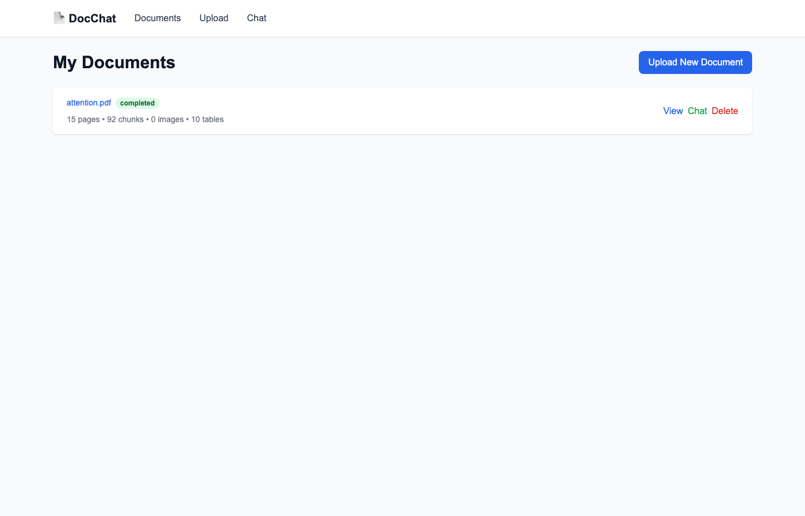
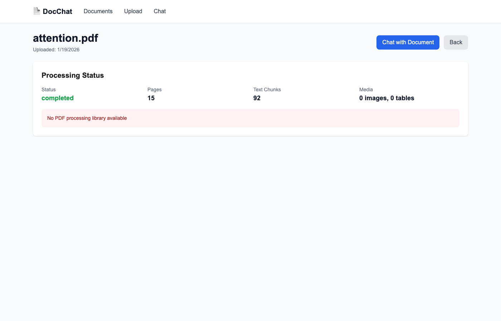
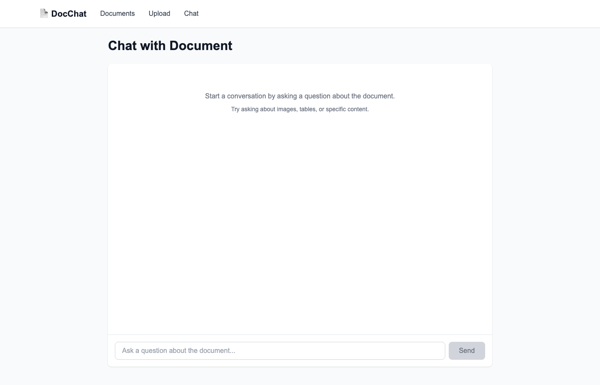
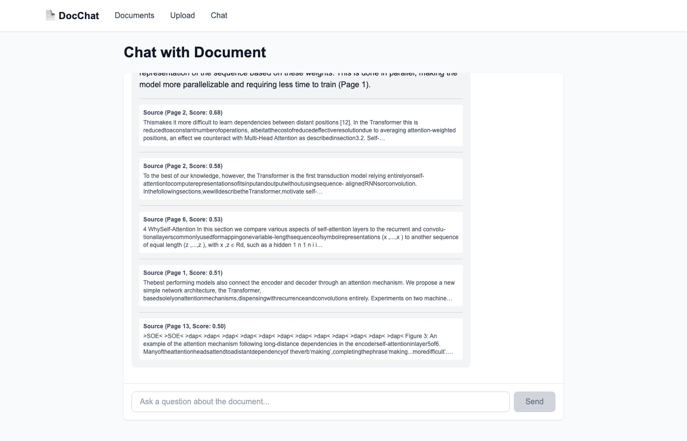
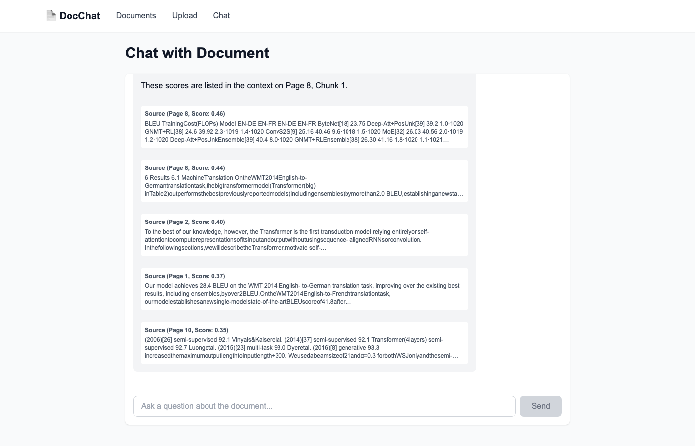
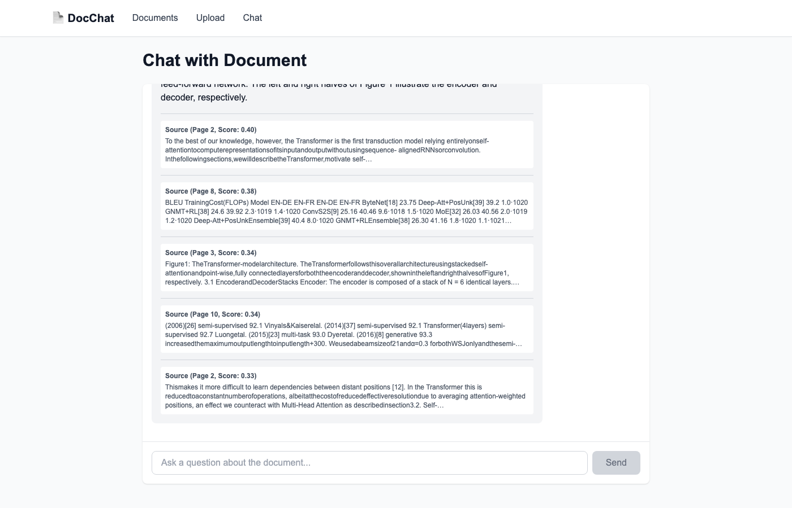
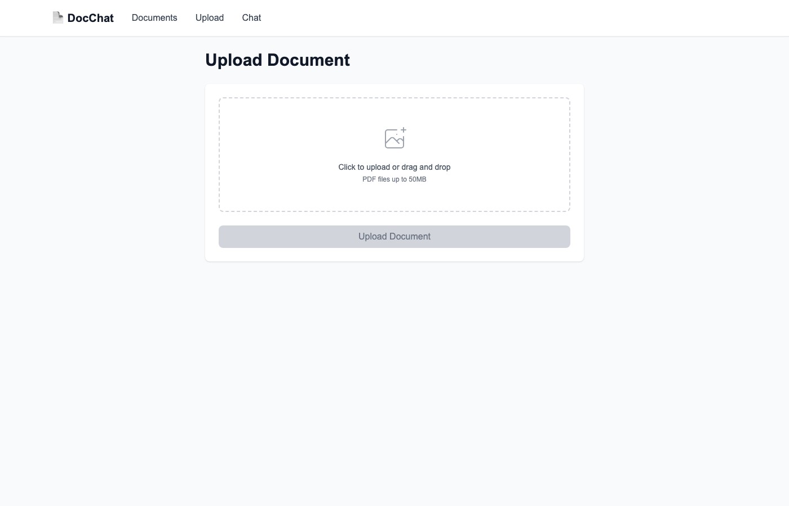

# Multimodal Document Chat System - Coding Test (AI Context Architect & Engineering Lead)

## Project Overview

**Focus**: Verify capability as an **AI Context Architect & Engineering Lead**.  
**Goal**: Build a system that parses PDF documents (text/image/table), constructs a retrieval workflow, and provides accurate answers via a multimodal chat interface.

> **Why this test?**  
> We are looking for a leader who can design the "Context" for LLMs, not just write code. We want to see your ability to design robust **Multimodal Workflows** and demonstrate **Technical Leadership** through architectural decisions.

---

## Core Competencies to Evaluate

1. **Context Engineering**: Ability to design data structures (Chunking, Embedding, Metadata) for optimal LLM understanding.
2. **Multimodal Workflow**: Ability to orchestrate text, images, and tables into a single coherent workflow.
3. **Technical Leadership**: Ability to diagnose bottlenecks, ensuring quality and performance.

---

## Provided Components (Starting Point)

The following items are **already implemented and provided**:

### Infrastructure Setup
- Docker Compose configuration (PostgreSQL+pgvector, Redis, Backend, Frontend)
- Database schema and models (SQLAlchemy)
- API base structure (FastAPI)
- Frontend base structure (Next.js + TailwindCSS)

### Database Models
- `Document` - Uploaded document information
- `DocumentChunk` - Text chunks (with vector embeddings)
- `DocumentImage` - Extracted images
- `DocumentTable` - Extracted tables
- `Conversation` - Chat sessions
- `Message` - Chat messages

### API Endpoints (Skeleton provided)
- `POST /api/documents/upload` - Upload document
- `GET /api/documents` - List documents
- `GET /api/documents/{id}` - Document details
- `DELETE /api/documents/{id}` - Delete document
- `POST /api/chat` - Send chat message
- `GET /api/conversations` - List conversations
- `GET /api/conversations/{id}` - Get conversation history

### Frontend Pages (Layout only)
- `/` - Home (document list)
- `/upload` - Document upload
- `/chat` - Chat interface
- `/documents/[id]` - Document details

---

## Core Features to Implement (Your Job)

Scale: **3 Core Features + 3 Design Deliverables**

### Part A: System Implementation (Implementation)

#### 1. Document Processing Pipeline (Critical)
**Location**: `backend/app/services/document_processor.py`
**Goal**: Parse PDF and structure data for Retrieval.

```python
class DocumentProcessor:
    async def process_document(self, file_path: str, document_id: int) -> Dict[str, Any]:
        """
        Implementation steps:
        1. Parse PDF using Docling
        2. Extract and chunk text (Context Engineering)
        3. Extract images/tables and create meaningful metadata linkage
        """
        pass
```

#### 2. Vector Store Integration (Critical)
**Location**: `backend/app/services/vector_store.py`
**Goal**: Store projections of multimodal data.

```python
class VectorStore:
    async def store_text_chunks(self, chunks: List[Dict[str, Any]], document_id: int) -> int:
        pass
    
    async def search_similar(self, query: str, document_id: Optional[int] = None, k: int = 5) -> List[Dict[str, Any]]:
        """
        Retrieve context with high relevance. 
        Think about how to retrieve 'Tables' or 'Images' associated with text chunks.
        """
        pass
```

#### 3. Multimodal Chat Engine (Critical)
**Location**: `backend/app/services/chat_engine.py`
**Goal**: Generate grounded answers using retrieved context.

```python
class ChatEngine:
    async def process_message(self, conversation_id: int, message: str, document_id: Optional[int] = None) -> Dict[str, Any]:
        """
        Orchestrate the RAG flow:
        1. Retrieve context (Text + Image + Table)
        2. Construct Prompt (Prompt Engineering)
        3. Generate Response via LLM
        """
        pass
```

---

### Part B: Design & Leadership (New Requirements)

In addition to code, please include the following in your `README.md` or separate markdown files (e.g., `DESIGN.md`).

#### 1. [Design Choice Document]
*   **Chunking Strategy**: Why did you choose this specific chunk size/overlap? Did you consider semantic chunking?
*   **Multimodal Linking**: How did you logically link extracted images/tables to text? (e.g., spatial proximity, explicit references in text?)

#### 2. [Evaluation Pipeline Design]
*   **Quality Metrics**: How will you measure the accuracy of answers? (e.g., "If I were to build an eval pipeline, I would check X, Y, Z...")
*   **Metrics**: Mention specific metrics like RAGAS (faithfulness, answer relevance) or LLM-as-a-judge approaches.

#### 3. [Prompt Versioning Strategy]
*   **Management**: Did you hardcode prompts? If you were to scale this, how would you manage prompt versions?
*   **Proposal**: Suggest a strategy to separate prompts from code (e.g., external templates, prompt registry).

---

## Evaluation Criteria (100 points)

### 1. Code Quality & Leadership (25 points)
- Design Patterns & Abstraction
- Readability for Junior Devs
- Error Handling & Resilience

### 2. Feature Implementation (30 points)
- Document Parsing (Docling)
- Vector Search Accuracy
- Multimodal RAG Flow

### 3. Systems Design & Engineering (30 points)
- **Context Engineering**: Logic behind chunking & metadata
- **Evaluation**: Depth of thought on quality assurance
- **Prompt Management**: Maturity of prompt handling

### 4. UX/UX & Documentation (15 points)
- `README` Quality (Design choices explanation)
- UI/UX interaction flow
- API Documentation

---

## Submission Requirements

1. **GitHub Repository**
2. **Source Code**
3. **Documentation** (README.md + DESIGN.md)
4. **Screenshots & Results** (using `1706.03762v7.pdf`)

---

## Sample PDF for Testing

**📄 Test Document**: ["Attention Is All You Need" Paper](https://arxiv.org/pdf/1706.03762.pdf)

Use this document to demonstrate:
1. **Architecture Diagram Retrieval**: Can it find Figure 1?
2. **Table Data Retrieval**: Can it answer questions about BLEU scores?
3. **Technical Context**: Can it explain "Self-Attention" using specific sections?

---

Good luck! We look forward to seeing your **Technical Leadership** and **Architectural Insight**.

---

## Implementation Guidelines

Refer to the service skeleton files for detailed implementation guidance:
- `backend/app/services/document_processor.py`
- `backend/app/services/vector_store.py`
- `backend/app/services/chat_engine.py`

---

## Free LLM Options (For Development)

You can use **Ollama** (free, local) or **Gemini/Groq** (free tier) to implement this without cost.

---

## FAQ

**Q: Where is the test PDF?**
A: `https://arxiv.org/pdf/1706.03762.pdf`

**Q: Can I use LangChain/LlamaIndex?**
A: Yes, but we value your ability to explain *how* it works under the hood.

---

## Screenshots & Demo Results

The following screenshots demonstrate the system functionality using the "Attention Is All You Need" paper.

### 1. Document List (Homepage)

- Shows uploaded document with processing status
- Displays extracted statistics: 15 pages, 92 chunks, 10 tables

### 2. Document Details

- Processing status and metadata
- Access to extracted content

### 3. Chat Interface

- Clean interface for document Q&A

### 4. Self-Attention Query

- **Question**: "What is Self-Attention and how does it work in the Transformer architecture?"
- **Result**: Successfully retrieves relevant context from pages 2, 6, and 13
- Shows source references with similarity scores

### 5. BLEU Scores Query

- **Question**: "What are the BLEU scores reported in the paper?"
- **Result**: Retrieves Table 2 data showing model comparisons
- Demonstrates table data retrieval capability

### 6. Architecture Query

- **Question**: "Can you describe the Transformer architecture shown in Figure 1?"
- **Result**: Retrieves descriptions of encoder-decoder architecture
- References Figure 1 from page 3

### 7. Upload Page

- Drag-and-drop interface for PDF uploads
- File size limit: 50MB

---

**Version**: 2.0 (Updated for AI Context Architect Role)
**Last Updated**: 2026-01-19
**Author**: InterOpera-Apps Hiring Team
